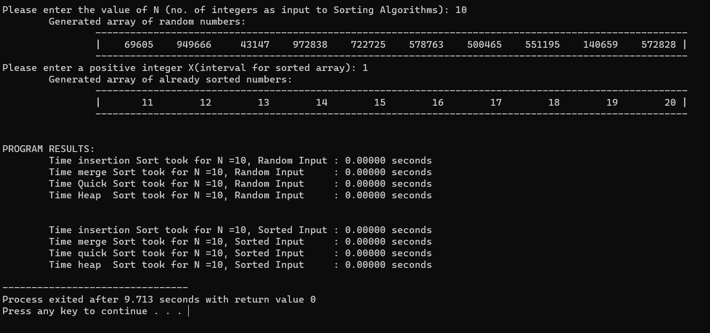

# A Performance Analysis on Basic Sorting Algorithms
This program uses different sorting algorithms (Insertion Sort, Merge sort, Quicksort, and Heapsort) to  sort 2 kinds of input:
1. N number if **unordered** and randomly generated integers. 
2. N number of **ordered** set of integers.

After sorting the input set, the efficiency of each algorithms are measured by their computing time.

---

## **Program Behavior**
1. The user is prompted to enter a value for **N** *(for number of integers)* as input.

2. The program generates **N** integers which are either
    - ***a.*** All integers are picked randomly with a uniform distribution from the range [0,1000000]; or

    - ***b.*** Sorted in the increasing order, wherein in addition to N , the program should also ask an input **X** *(a positive number)* from the user and set the first element of the array to **N+X** , the second element to **N+2 X** and so on (generating an increasing sequence of N numbers).

3.  The program sorts these N integers using the different algorithms and outputs a file with original and sorted values.

4.  The program also outputs the computation time T(N) for sorting N integers. Be sure that this time includes only the computation time and not the time spent interacting with user and or generating the integers.

 

## **Output Analysis**
 
<table>
<tr><th> <b>Average running time for a random input array</b> </th></tr>
<tr><td>

| N | Insertion Sort | Merge Sort | Quicksort | Heapsort | 
|--:|--:|--:|--:|--:|
| 10 | 0 | 0 | 0 | 0 |
| 100 | 0 | 0 | 0 | 0 |
| 1,000 | 0 | 0 | 0 | 0 |
| 10,000 | 0.1472  | 0.0082 | 0 | 0.0032 |
| 100,000 | 13.5048 | 13.5048 | 0.0192 | 0.0412 |

</td></tr>
</table> 

<table>
<tr><th> <b>Average running time for a sorted input array</b> </th></tr>
<tr><td>

| N | Insertion Sort | Merge Sort | Quicksort | Heapsort | 
|--:|--:|--:|--:|--:|
| 10 | 0 | 0 | 0 | 0 |
| 100 | 0 | 0 | 0 | 0 |
| 1,000 | 0 | 0.0024 | 0.0112 | 0.0002 |
| 10,000 | 0  | 0.0042 | 0.5360 | 0.0030 |
| 100,000 | 0.0008 | 0.0440 | 0.044 | 0.0346 |

</td></tr>
</table>

**The values presented are time in seconds.*

 

+ **Insertion sort** progressively gets slower as the input size gets larger for random input. It’s also the slowest algorithm for a random array. In the worst case, this algorithm would perform `O(n^2)` time. For an input array that is already sorted, insertion sort is always fast no matter the size of N. This is the best case for insertion sort as it takes only `O(n)` time.

+ The time for **Merge sort** is consistently fast, and grows longer as N gets larger. And it doesn’t matter if the array is random or already sorted. This is because the time complexity of merge sort for all cases, is always `O(n*log n)`. Its downside is that it takes more memory space, because we need to also declare temporary arrays that will store the divided subarrays.

+ **Quicksort** is the fastest performing algorithm for a randomized array, so we can say its name is well deserved. Like other divide-and-conquer algorithms, its average time is `O(n*log n)`. However, the case is the complete opposite if it analyzes an array that is already sorted.
Quicksort is notably the slowest across all values of N, if the input array is already sorted. This is because the chosen pivot for quicksort is always the last element, which will always be the largest because the array is sorted in ascending order. Therefore, partitioning will take `O(n)` time (no swapping will be done anyways), for all the n-number of elements. So for worst case, time will be `O(n^2)`.

+ **Heapsort**, although not a divide-and-conquer algo, is similar to how merge sort behaves, where it doesn’t matter very much if the input array is random or already sorted. Heapsort is an efficient, unstable sorting algorithm with an average, best-case, and worst-case time complexity of `O(n log n)` so we can say that it is a good all-rounder.

---
 

## **CONCLUSIONS**

- As expected, the time it takes for all the sorting algorithms to process the data also increases directly proportional as N grows larger.

- Quick sort is the best sorting algorithm to use if the array to be sorted is randomly spread. However, we need to be careful in using it, because feeding an already sorted array into quicksort will take a lot of time to process.

- Inversely, Insertion sort works best in an array that is already sorted, but would struggle in practical use, because we usually arrange unsorted data in real world scenarios.
